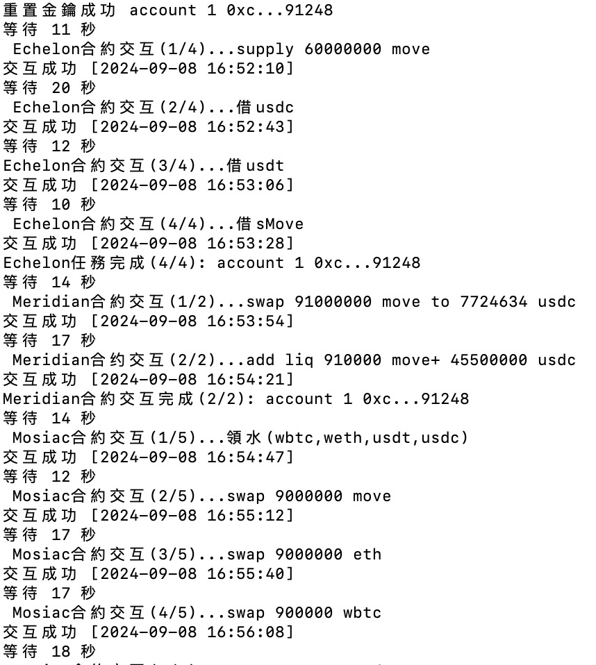

# Movement-aptos-mac-v1.0
本腳本為Mac版本，Win版開發中，預計這週推出  
需要閱覽權限請聯絡[作者](https://x.com/jason2290_eth)
1. 金鑰填入keys.csv中  
第一欄填入帳號名 格式不限  
第二欄填入aptos金鑰 一行一個
2. 可配置參數在main.sh中(第4-6行的位置)  
wait_time_min=10 #填入最小等待时间（秒）  
wait_time_max=20 #填入最大等待时间（秒）  
proxy_ip="" 填入你的ip  
3. swap金額和add liquidity金額會隨機變動  
4. 在資料夾下執行以下code啟動  
 ```
chmod +x mint.sh
./mint.sh
 ```


執行正確結果如下  

